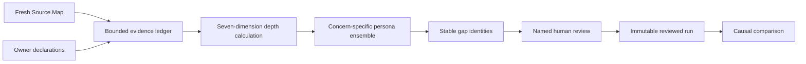

# Reproducible Archaeology and Discovery Depth

EWAI can make the depth of Archaeology and Discovery explicit, proportionate, and repeatable. It does this without treating a long backlog as evidence of depth and without depending on identical prose from different model sessions.

The capability is local and optional. It does not send feedback to a hosted service, execute production code, enforce runtime policy, install premium personas, or grant Build, Manual QA, deployment, or release approval.


<!-- editorial: contents -->
## On this page

- [Decide how far to investigate](#decide-how-far-to-investigate)
- [What it produces](#what-it-produces)
- [How consistency is achieved](#how-consistency-is-achieved)
- [The seven dimensions](#the-seven-dimensions)
- [Before you begin](#before-you-begin)
- [Use it in Guided Setup](#use-it-in-guided-setup)
- [Use it from the CLI](#use-it-from-the-cli)
- [Use it from an agent or integration](#use-it-from-an-agent-or-integration)
- [How personas work](#how-personas-work)
- [Stable gaps and grouping](#stable-gaps-and-grouping)
- [Understanding comparisons](#understanding-comparisons)
- [Protect engineering performance while reducing tokens](#protect-engineering-performance-while-reducing-tokens)
- [Failure and recovery](#failure-and-recovery)
- [Boundaries](#boundaries)
- [Related guides](#related-guides)

## Decide how far to investigate

Start with the intended change and its consequences. A small interface adjustment and a migration of sensitive data need different investigation. EWAI recommends depth independently for architecture, data, security, product, delivery, governance and operations; you review those choices rather than accepting a single overall score.

Preparation gives you recommendations, supporting evidence, gaps and a review route. Resolve material questions with their owners, or retain them explicitly. A lower depth needs a reason; a deeper recommendation doesn't claim the investigation has already been done.

## What it produces

A prepared workspace contains:

- independent recommendations for architecture, data, security, product, delivery, governance, and operations;
- the evidence drivers and coverage behind each recommendation;
- explicit inventory-only, sensitive, oversized, failed, and excluded surfaces;
- deterministic stable gap identifiers;
- adaptive questions for missing or contradictory owner evidence;
- the core, project, personal, and optional installed premium personas active for each concern;
- a proposed grouping strategy that remains separate from gap identity.

A named review records:

- the selected depth for every dimension;
- rationale when the owner reduces a recommendation;
- an explicit group and disposition for every gap;
- the exact preparation digest, Source Map run, evidence, provider capability, and persona set reviewed;
- an immutable run ID and content digest under `SPECS/3.Evidence/discovery-depth/runs/`.

A comparison explains changes in causal order: inputs, evidence, personas, selected depth, coverage, stable gaps, and grouping.

## How consistency is achieved

EWAI does not ask a model to reproduce the same narrative. It makes the inputs,
decisions, and material findings reviewable as structured evidence instead.



| Control | Contribution to consistency |
| --- | --- |
| Fresh Source Map | Binds repository observations to one known analysis run and keeps failed, excluded, sensitive, oversized, and inventory-only surfaces visible. |
| Bounded owner evidence | Records authority, answer codes, reason codes, and digests without copying free-text source material into the preparation. |
| Seven independent dimensions | Prevents repository size or backlog length from acting as a crude proxy for depth. |
| Explicit persona ensemble | Records which core, project, personal, or installed premium perspectives influenced each concern and why. |
| Stable gap identity | Derives each ID from the dimension, condition, state codes, and evidence references rather than generated wording. |
| Named review | Requires a human to select depth, justify reductions, and assign every gap without transferring approval authority to a persona or model. |
| Fingerprinted run | Binds the reviewed result to its inputs, evidence, personas, depth, coverage, gaps, and grouping. |
| Causal comparison | Separates explained input, evidence, persona, depth, coverage, gap, and grouping changes from unexplained variance. |

Two runs can therefore use different sentences and still be reproducible when
their material evidence, depth, and stable gaps agree. Conversely, matching prose
does not make two runs reproducible when one omitted a failed analysis surface or
used different owner evidence without recording the cause.

See the [worked example](examples/reproducible-archaeology-depth-example.md) for
an end-to-end illustration and use the
[operator and Manual QA checklist](quality/reproducible-archaeology-depth-review-checklist.md)
when assessing a real project.

## The seven dimensions

| Dimension | Typical evidence and questions |
|---|---|
| Architecture | Repository topology, component boundaries, dependencies, integrations, and conflicting implementation patterns |
| Data | Data models, classification, retention, movement, residency, ownership, and sensitive-file exclusions |
| Security | Trust boundaries, identities, exposure, authorization, threats, and owner-confirmed security constraints |
| Product | Intended users, outcomes, journeys, exceptions, acceptance, and differences between live behaviour and owner intent |
| Delivery | Test evidence, release route, standards, quality gates, technical debt, and retained Source Map analysis failures |
| Governance | Applicable policy, accountable decisions, assurance ownership, exceptions, and review obligations |
| Operations | Hosting, environments, observability, recovery, continuity, support, and named operational ownership |

Each dimension is selected independently as `bounded`, `standard`, or `deep`. A large repository may need deep architecture analysis but bounded product discovery for a narrowly scoped internal utility. A small service handling sensitive data may need deep data and security analysis even when its architecture is simple.

## Before you begin

1. Initialise EWAI and confirm `.ewai-pipeline/project.json` points to the intended project and SPECS root.
2. Complete the human project briefing. Repository code can establish observable behaviour, not why the project should exist.
3. Register and review relevant imported evidence where applicable.
4. Refresh the Repository Source Map:

```bash
ewai index refresh --project /path/to/project --json
```

5. Confirm that failures, inventory-only files, sensitive files, oversized files, and exclusions are visible. Do not silently remove them to improve the coverage status.

## Use it in Guided Setup

Open the local dashboard and choose **Guided Setup**. The **Evidence depth** panel appears inside the existing Discovery workspace; it is not a separate product or primary navigation area.

1. Select **Prepare evidence depth**.
2. Review the seven-row ledger. Each row shows coverage, recommendation, owner selection, and the personas active for that concern.
3. Review the stable gaps separately from the adaptive questions.
4. Enter the named reviewer.
5. Select a depth for every dimension. Add rationale if reducing a recommendation.
6. Give every gap a group and disposition.
7. Select **Record named review**.
8. When at least two runs exist, select the runs and compare them.

Answered Guided Setup fields are projected as `declared` owner evidence for browser preparation. EWAI hashes their normalized values and records bounded question and revision codes; the answer text itself is not copied into the evidence-depth preparation or reviewed run. Re-prepare after materially changing Discovery answers so the named review binds to the current declarations.

The current UI uses EWAI's default fallback visual system unless the project applies an approved Design System Pack. The panel labels that condition; the fallback is not organisation-approved.

## Use it from the CLI

Inspect the current status:

```bash
ewai archaeology depth-status --project /path/to/project --json
```

Prepare from repository evidence only:

```bash
ewai archaeology depth-prepare \
  --focus "security recovery and product outcomes" \
  --project /path/to/project \
  --json
```

To add owner evidence, create a project-relative JSON file. The example below is illustrative: `sha256:security-boundary-review` is an accepted symbolic evidence identifier, not a calculated SHA-256 checksum and not proof that a file was verified. Use identifiers tied to the evidence actually reviewed by your owner.

```json
{
  "focus": "security recovery and product outcomes",
  "ownerEvidence": [
    {
      "id": "owner:security-boundary",
      "dimension": "security",
      "authority": "confirmed",
      "evidenceDigest": "sha256:security-boundary-review",
      "answerCode": "internal-users-only",
      "reasonCode": "named-owner-review",
      "contradiction": "none"
    }
  ]
}
```

Then run:

```bash
ewai archaeology depth-prepare \
  --input evidence-depth-input.json \
  --project /path/to/project \
  --json
```

Owner evidence uses bounded codes and digests. Do not place free-text answers, source bodies, secrets, absolute paths, or managed persona content in this file.

Create a review JSON from the returned preparation. It must name a reviewer, bind to the exact preparation digest, cover all seven dimensions exactly once, and assign every gap exactly once. Record it with:

```bash
ewai archaeology depth-record \
  --input evidence-depth-review.json \
  --project /path/to/project \
  --json
```

Compare two stored runs:

```bash
ewai archaeology depth-compare LEFT_RUN_ID RIGHT_RUN_ID \
  --project /path/to/project \
  --json
```

Comparison reads the exact stored runs. It does not rescan the repository.

## Use it from an agent or integration

The MCP server exposes:

- `ewai_evidence_depth_status`
- `ewai_evidence_depth_prepare`
- `ewai_evidence_depth_record`
- `ewai_evidence_depth_compare`

`status` and `compare` are read-only. `prepare` writes a disposable runtime preparation, while `record` creates immutable project evidence. All tools use the project root bound when the MCP server starts; caller-supplied project roots are not accepted.

Use `$ewai-evidence-depth` for the complete agent workflow and input contract. `$ewai-archaeology` and `$ewai-project-discovery` route into it when an agreed, repeatable investigation boundary is needed.

## How personas work

EWAI chooses a small ensemble for the concern currently being examined:

- **core personas** provide portable Archaeology, curation, engineering, and operational lenses;
- **project personas** represent local roles and working conventions;
- **personal personas** can contribute an explicitly installed individual lens;
- **premium personas** add specialist challenge when the managed library is already installed and relevant.

The UI shows the persona name, tier, reason for engagement, and dimension. The ensemble changes as the dimension changes. EWAI does not load the whole catalogue merely because it is available.

The standard model and core/project workflow remain complete without premium personas. This feature never downloads or synchronises premium content automatically. Personas cannot confirm owner evidence, select depth, group gaps, or approve delivery.

## Stable gaps and grouping

A gap identity comes from its dimension, condition, current-state code, intended-state code, and evidence references. That identity remains stable when the same structured gap is found again.

Grouping is a later human decision. The same security gap can be grouped under an assurance intent, a product outcome, or a platform boundary without changing the gap itself. This distinction lets teams compare whether evidence changed or only their work-organisation choice changed.

## Understanding comparisons

| Comparison field | A material change usually means |
|---|---|
| Inputs | Project, Source Map, contract, pack, provider capability, or exclusions changed |
| Evidence | The governed repository or owner evidence set changed |
| Personas | A different identity or tier was actively engaged |
| Depth | A recommendation or named owner selection changed |
| Coverage | Required, supported, excluded, or failed coverage changed |
| Gaps | The deterministic set or reviewed gap state changed |
| Grouping | The explicit grouping strategy or assignment changed |

Wording or ordering differences do not change run identity when the structured evidence is the same. A grouping-only change is explainable. A coverage or gap change without a material upstream explanation is reported as unexplained variance and the comparison is not reproducible.

## Protect engineering performance while reducing tokens

This capability uses Source Map counts, profiles, bounded evidence identifiers, fingerprints, and immutable reviewed runs. It does not copy repository bodies into the depth ledger or rerun analysis for comparisons.

When optimising context or token demand, compare a known-good reviewed run with the new route. The optimisation is acceptable only if the same material surfaces, standards, constraints, gaps, failure paths, and test obligations remain discoverable. Faster or cheaper output is not an improvement when engineering coverage falls.

Use [Context management and token efficiency](context-management-and-token-efficiency.md) for context-pack design and benchmark guidance, and [Repository Source Map](repository-source-map-guide.md) for coverage mechanics.

## Failure and recovery

| Status or error | What to do |
|---|---|
| `source-map-missing` | Refresh the Source Map |
| `source-map-stale` | Refresh it and prepare again; do not reuse the stale recommendation |
| `not-prepared` | Prepare after reviewing the available evidence inputs |
| Newer preparation or stale digest | Reload status and repeat the named review against the current digest |
| Reduced depth needs rationale | Record substantive accountable rationale or restore the recommendation |
| Gap is unassigned | Choose an explicit group and disposition |
| Unexplained comparison variance | Restore the missing evidence context or retain the run as non-reproducible |

Never recover by silently dropping a failed, excluded, contradictory, or unknown surface.

## Boundaries

- This is investigation evidence, not a quality score.
- It does not guarantee complete Archaeology or Discovery; the selected boundary and coverage ledger remain accountable.
- It does not make persona output stakeholder research.
- It does not certify security, compliance, accessibility, or production readiness.
- It does not replace the canonical Build, standards, test, Manual QA, deployment, or release gates.
- Feedback remains local. This feature doesn't upload it to a hosted feedback service.

## Related guides

- [Worked example: reproducible Archaeology and Discovery depth](examples/reproducible-archaeology-depth-example.md)
- [Operator and Manual QA checklist](quality/reproducible-archaeology-depth-review-checklist.md)
- [Repository Source Map](repository-source-map-guide.md)
- [Guided Discovery facilitator guide](guided-discovery-facilitator-guide.md)
- [Context management and token efficiency](context-management-and-token-efficiency.md)

## If preparation reports too many personas

`Evidence depth: personas exceeds 8 entries` means this release assembled more persona identities across the seven dimensions than its input contract accepts. Preparation hasn't succeeded. This can occur with a larger available catalogue; it isn't proof that your source evidence or licence is invalid.

Keep your project and persona files unchanged and report the error with the release version and a safe description of the operation. Don't delete personas, edit the generated preparation or claim the depth review completed. The selection/validation mismatch needs a harness correction; changing your requirements isn't the remedy.
